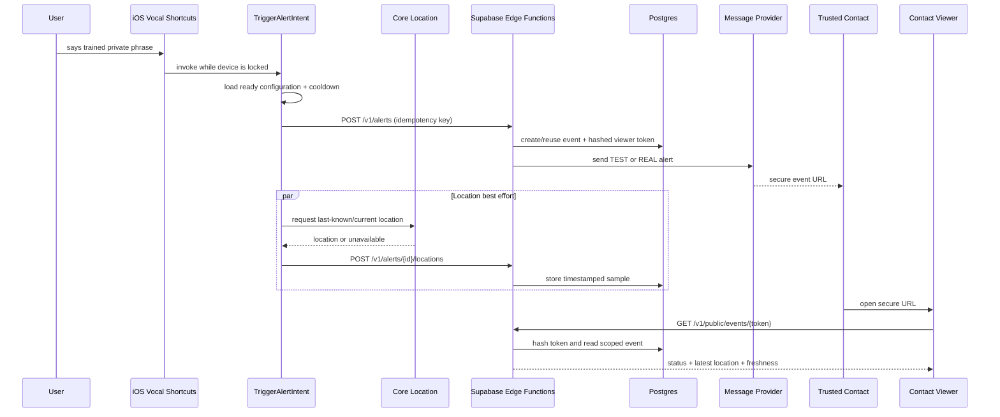

# SafeWord V1 System Design

## Architecture decision

The locked-screen phrase is implemented with Apple’s system-owned Vocal Shortcuts and App Intents. SafeWord does not keep its own speech recognizer running in the background.

This decision is subject to one Day-1 physical-device proof. If the intent cannot reliably run while locked, use the documented Siri/Action button fallback and describe the limitation honestly.

## Stack

- **iOS:** Swift, SwiftUI, App Intents, Core Location, Local Authentication, Keychain, URLSession, XCTest.
- **Minimum OS:** iOS 18, because Vocal Shortcuts is the core product capability.
- **Local persistence:** a small actor-backed repository; sensitive credentials in Keychain, non-sensitive state/outbox in an app-group container.
- **Backend:** Supabase Postgres, Auth, migrations, Row Level Security, and Edge Functions.
- **Viewer:** TypeScript + React/Vite, deployed to Vercel; mobile-first polling client.
- **Messaging:** one selected production provider behind an adapter plus one deterministic fake adapter for tests. Add SMS/another real provider only after production sender validation and all release gates are green.
- **Map:** MapLibre with a configured tile provider; text address/coordinates and external map link remain available if tiles fail.
- **Payments:** RevenueCat iOS SDK and RevenueCatUI only if it saves time without compromising the design.
- **Observability:** privacy-filtered Edge Function logs and one crash reporter; no phrase, transcript, full token, contact destination, or precise coordinate in telemetry.

Exact package versions are locked when the projects are scaffolded, not guessed in this document.

Use exactly two environments during the sprint:

- **development/test:** local work, automated tests, provider test mode, and RevenueCat Test Store/App Store sandbox;
- **production:** App Review, TestFlight/public build, production viewer, and real provider credentials.

Do not add a separate staging environment in eight days. Keep environment-specific values typed, validated at startup, and stored outside source control.

## System context

```text
User voice
  → iOS Vocal Shortcuts (on-device phrase recognition)
  → SafeWord TriggerAlertIntent (locked/background execution)
  → Alert API (authenticated and idempotent)
  → Postgres event + secure viewer token
  → Message provider
  → Trusted contact
  → Public viewer API using opaque token
```

## Core sequence



## Locked-device execution contract

`TriggerAlertIntent` is deliberately narrow:

1. It may run without device authentication because the only action is to alert a contact the user preconfigured.
2. It never exposes contact details, history, settings, tokens, or location to the person invoking it.
3. It does not speak sensitive confirmation aloud.
4. It immediately creates/reuses the alert before waiting for a fresh GPS fix.
5. It attaches cached/last-known location, then attempts a fresh sample within a strict time budget.
6. It uses credentials available after first unlock and stored as device-only where supported.
7. It persists a redacted pending action if the network call fails.
8. It applies a server-enforced and client-enforced cooldown.

Day-1 tests must establish what happens after reboot-before-first-unlock, in airplane mode, with Low Power Mode, with the app force-quit, and when the location permission is denied.

## Components and responsibilities

### iOS application

- Onboarding, permission education, contact setup, Vocal Shortcut guide, test alerts, readiness, active-alert status, settings, purchase/restore, delete data.
- Does not own continuous background listening.
- Shows manual and Action button/Siri fallbacks.

### App Intent

- Validates that setup is ready.
- Generates invocation ID and reads current cooldown/event state.
- Calls alert API and best-effort location update.
- Records only redacted outcome data.

### Alert API

- Authenticates the device identity.
- Enforces rate limits and idempotency.
- Creates the event and high-entropy viewer token.
- Sends through an adapter; never exposes provider credentials to the app.
- Returns a canonical event ID and delivery state.

### Viewer API

- Accepts only the opaque token from the URL.
- Hashes it and returns a projection for one event.
- Never returns internal user/contact IDs or prior history.
- Uses server timestamps to calculate freshness.

### Contact viewer

- Polls every 10 seconds while visible, backs off when hidden/failing.
- Clearly distinguishes TEST, ACTIVE, RESOLVED, EXPIRED, and LOCATION UNAVAILABLE.
- Gives the contact practical next steps without claiming police dispatch.

### RevenueCat service

- Maps RevenueCat customer information to one `plus` entitlement.
- Is isolated from all trigger/alert code.
- Failure returns a free-tier state and never blocks alerts.

## Data model

### `profiles`

- `id uuid primary key` matching authenticated user
- `display_name text`
- `created_at timestamptz`
- `deleted_at timestamptz null`

### `trusted_contacts`

- `id uuid primary key`
- `user_id uuid references profiles`
- `name text`
- `channel text check (email|sms)`
- `destination_ciphertext text`
- `destination_fingerprint text` for deduplication, never display
- `status text check (pending|confirmed|disabled)`
- `confirmed_at timestamptz null`
- `created_at timestamptz`

### `alert_events`

- `id uuid primary key`
- `user_id uuid`
- `trusted_contact_id uuid`
- `idempotency_key uuid`
- `kind text check (test|real)`
- `state text check (pending|active|resolved|expired)`
- `trigger_method text check (vocalShortcut|siri|actionButton|manual)`
- `triggered_at timestamptz default now()`
- `resolved_at timestamptz null`
- unique `(user_id, idempotency_key)`

### `location_samples`

- `id bigint generated always as identity`
- `alert_event_id uuid`
- `captured_at timestamptz`
- `received_at timestamptz default now()`
- `latitude double precision`
- `longitude double precision`
- `horizontal_accuracy_m double precision`
- `expires_at timestamptz`
- index `(alert_event_id, received_at desc)`

### `alert_deliveries`

- `id uuid primary key`
- `alert_event_id uuid`
- `provider text`
- `provider_message_id text null`
- `attempt_count int`
- `status text check (queued|sent|delivered|failed)`
- `last_error_code text null`
- timestamps

### `viewer_tokens`

- `id uuid primary key`
- `alert_event_id uuid`
- `token_hash bytea unique`
- `expires_at timestamptz`
- `revoked_at timestamptz null`

Do not create a separate subscription table in V1. RevenueCat is source of truth.

## State machines

### Client readiness

```text
notConfigured → configuring → ready
                     ↘ degraded(reason)
```

### Alert

```text
ready → triggering → pendingDelivery → active → resolving → resolved
           ↘ queuedOffline        ↘ recoverableError
```

Invariants:

- an invocation inside the cooldown cannot create a second event;
- an event cannot return from resolved to active;
- a delivery retry cannot create a new event;
- location failure cannot erase or fail an alert;
- viewer data is scoped to exactly one valid token;
- RevenueCat state never participates in an alert transition.

## Suggested repository structure

```text
apps/
  ios/SafeWord/
    App/
    Core/
      Configuration/
      Logging/
      Security/
    Domain/
      Alerts/
      Contacts/
      Readiness/
      Subscription/
    Services/
      AlertAPI/
      AppIntents/
      Location/
      Persistence/
      RevenueCat/
    Features/
      Onboarding/
      Home/
      VocalShortcutSetup/
      ContactSetup/
      AlertStatus/
      Settings/
      Paywall/
    DesignSystem/
    Tests/
  viewer/
    src/
      api/
      components/
      pages/
      styles/
    tests/
supabase/
  migrations/
  functions/
    create-alert/
    add-location/
    resolve-alert/
    public-event/
    contact-verification/
  tests/
docs/
.github/workflows/
```

## Failure strategy

- **Vocal Shortcut unavailable:** readiness shows unsupported; offer Siri/App Shortcut, Action button, and manual trigger.
- **Intent cannot access credentials while locked:** fail Day-1 gate; adjust Keychain accessibility and execution target, then retest. Never fall back to embedding a service key.
- **No network:** queue a redacted trigger, show local state when next opened, retry via permitted background opportunity; never claim delivery.
- **No location:** send the alert with “Location unavailable.”
- **Provider failure:** retry a bounded number of times, use configured fallback, record honest delivery status.
- **Viewer map failure:** show timestamped coordinates and an external map link.
- **Backend outage:** preserve idempotency key and retry; do not generate repeated alerts.
- **RevenueCat outage:** free safety functionality continues.

## Privacy boundaries

- The system, not SafeWord, recognizes the phrase.
- The phrase and audio never enter SafeWord storage, backend, logs, or analytics.
- Precise location is collected only after an explicit alert or during a user-started location mode.
- Contact destination is encrypted at rest and redacted in logs.
- Viewer tokens are high entropy, hashed at rest, expiring, and revocable.
- Location samples expire automatically after the retention window.

## Direct police dispatch

No generic “nearest police” endpoint exists that SafeWord can responsibly call worldwide. V1 must not email, SMS, or post user data to a police station discovered from a map search.

Direct public-safety dispatch is a future integration requiring a licensed/authorized regional partner, verified routing coverage, consent, operational monitoring, auditability, and legal review. Until then:

- SafeWord alerts confirmed trusted contacts;
- the viewer shows an explicit suggestion to call the appropriate local emergency number;
- the app may provide a user-initiated telephone action;
- copy says exactly who received the alert.
