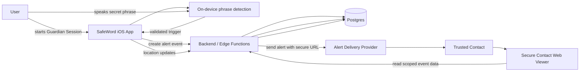

# SafeWord — Shipaton 2026 Master Product & Execution Brief
## Codex Sol High handoff · 8-day intensive build plan

**Project:** SafeWord  
**Target event:** RevenueCat Shipaton 2026  
**Primary platform:** iPhone / iOS first  
**Build mode:** Intensive, production-minded, fast vertical delivery  
**Available founder time:** At least 6 focused hours/day for 8 days, working closely with ChatGPT + Codex  
**Quality target:** A submission whose product thinking, engineering quality, visual design, safety model, reliability, and demo are credible for **top-prize consideration**, especially the **RevenueCat Peace Prize, RevenueCat Design Award, Next Gen Award**, and—if traction can be generated quickly—the Grand Prize.

> **Reviewed execution amendment — 20 September 2026**
>
> This brief remains the product north star, but execution must follow the reviewed documents in `docs/`, especially `docs/8_DAY_EXECUTION_PLAN.md`. They narrow the scope and correct schedule, platform, delivery, and release assumptions discovered during review.
>
> **Verified Shipaton facts:** standard entries must publish a brand-new app between 1 August and 30 September 2026; Devpost submissions close **1 October 2026 at 06:45 UTC**; a real RevenueCat-powered purchase is required; Next Gen is a separate student-only route requiring a public source repository and student/academic email rather than a store release.
>
> **Immediate gates:**
> - freeze one public product name: `SafeWord`, `SignalWord`, and `WordSignal` are currently used inconsistently;
> - install and select full Xcode before any iOS implementation (this Mac currently exposes only Command Line Tools);
> - initialize a repository inside this folder before committing (the current Git root is the parent `Projects` folder);
> - confirm Apple Developer/App Store Connect access, agreements, a physical iPhone, RevenueCat, backend hosting, a public support/privacy domain, and a viable alert-delivery provider;
> - submit the first App Store release candidate by **Day 4**, not Day 5, and keep Days 5–8 for review fixes and submission proof;
> - prove Apple Vocal Shortcuts invoking a SafeWord App Intent while locked; do not imitate Siri with an indefinite app-owned microphone service;
> - treat SMS as conditional on verified sender/provider readiness; keep a verified email delivery path as the reliable fallback;
> - target Peace Prize, Design Award, and Build in Public first; target Next Gen only if student eligibility is confirmed; treat Grand Prize as a traction-dependent bonus rather than the primary eight-day objective.
>
> **Clarified core behavior:** the hero requirement is a custom phrase that can trigger while the iPhone is locked, similar to “Hey Siri.” A third-party app must not imitate Siri by running an indefinite hidden microphone service. The preferred V1 is **Apple Vocal Shortcuts → SafeWord App Intent → idempotent alert workflow**. The user trains “cat rainbow” in iOS; Apple processes the phrase on device and invokes our action without opening the app. SafeWord does not receive or store the phrase audio. Day 1 must prove that the intent runs while locked, can access safe credentials, creates the alert, and obtains at least a last-known location.
>
> **Scope correction:** V1 is one system-level vocal shortcut, one confirmed trusted contact, one alert, a secure contact page, honest location freshness, a test mode, an offline outbox, and one non-critical RevenueCat entitlement. A Guardian Session may improve readiness/location but cannot be the only way to trigger. Multiple contacts, app-owned always-on listening, speaker-biometric claims, analytics dashboards, and direct police dispatch are post-Shipaton work.
>
> **Emergency-services boundary:** V1 alerts trusted contacts and gives them precise, time-stamped information. It may offer a user-initiated call to the local emergency number. It must not automatically send personal/location data to the “nearest police” without an authorized regional emergency-dispatch partner, verified legal/operational coverage, and explicit consent. Never imply that an emergency service received an alert when it did not.

> **Codex Sol High: treat this document as the project contract.**
>
> Your first job is to turn it into a concrete, dependency-aware 8-day execution plan, then help execute it with aggressive verification and minimal rework. Do not optimize for the amount of code written. Optimize for a small, unforgettable, reliable product that works end-to-end.

---

# 1. Mission

Build a real, polished personal-safety app called **SafeWord** around one instantly understandable interaction:

> **A distress signal you do not have to visibly tap.**

A user chooses a private, unusual phrase such as:

> “cat rainbow”

Before a situation in which they want additional safety, the user deliberately starts a **Guardian Session**.

During that session, SafeWord listens locally for the user’s chosen phrase. When the phrase is recognized with sufficient confidence, SafeWord silently initiates the user’s preconfigured SOS workflow:

1. give the user a subtle confirmation;
2. create an emergency event;
3. capture current location;
4. notify trusted contacts;
5. provide a secure live-location link;
6. continue updating the contact-facing safety view;
7. allow the user to cancel through a deliberate safe-cancel action.

The app must **not** pretend to determine whether a person is objectively in danger. It must **not** autonomously dispatch police. The user-defined phrase is the user’s explicit decision to activate their safety workflow.

The product thesis is simple:

> In some dangerous or coercive situations, reaching for a phone, visibly pressing an SOS button, or saying “help me” may escalate the situation. SafeWord gives the user a discreet, pre-authorized way to signal trusted people using ordinary speech.

---

# 2. Product positioning

## One-line pitch

**SafeWord turns a private phrase into a discreet SOS for the moments when reaching for your phone may not feel safe.**

## Short pitch

SafeWord lets people create a private spoken safety phrase, start a temporary Guardian Session, and discreetly alert trusted contacts with live location if they use that phrase. The user stays in control; ordinary conversations remain private; emergency essentials are never paywalled.

## Emotional product promise

The product should feel:

- calm, not alarmist;
- private, not surveillant;
- fast, not complicated;
- trustworthy, not gimmicky;
- empowering, not fear-driven;
- beautifully designed, not like an unfinished hackathon prototype.

## What SafeWord is NOT

SafeWord is not:

- an “AI predicts whether you are being attacked” system;
- an always-on surveillance microphone;
- a replacement for emergency services;
- an automatic police-dispatch system;
- a medical device;
- a guarantee of rescue or response;
- a product that records or uploads ambient conversations by default.

---

# 3. The “wow” moment

The entire product and Shipaton demo should be built around one unforgettable vertical slice.

### Demo sequence

1. User opens SafeWord.
2. They have already configured:
   - secret phrase: **“cat rainbow”**
   - trusted contact
   - alert message
3. User taps **Start Guardian**.
4. The interface transitions into a calm, minimal active state.
5. User says the exact phrase naturally in a sentence.
6. The phone gives a subtle haptic.
7. Within seconds:
   - an alert event is created;
   - current location is captured;
   - the trusted contact receives an alert;
   - a secure link opens a polished live-location safety page.
8. The user’s location updates on the contact view.
9. The user ends the event safely.

The judge should understand the product in **under 10 seconds** and see the end-to-end proof in **under 60 seconds**.

---

# 4. Shipaton 2026 constraints that must shape execution

Current Shipaton submission requirements include:

- working software app for iOS/iPadOS/macOS/Android;
- RevenueCat SDK must power at least one in-app or web purchase;
- first public store release must occur during the eligible Shipaton release window for ordinary store-based eligibility;
- Devpost description;
- public YouTube/Vimeo demo video;
- demo should keep essential footage within 2 minutes;
- public store URL for standard submission path;
- 1024×1024 app icon;
- at least one 1179×2556 screenshot without a device frame;
- free trial or promo-code path for judges to access premium features;
- a RevenueCat project ID.

The student **Next Gen Award** has a lower-friction path based on video + open-source repository rather than requiring a store listing.

### Award strategy

SafeWord should be intentionally optimized for:

1. **RevenueCat Peace Prize**
   - clear social benefit;
   - safety essentials available without a paywall;
   - privacy-first architecture;
   - thoughtful risk reduction.

2. **RevenueCat Design Award**
   - distinctive visual identity;
   - premium motion and haptics;
   - one-handed flows;
   - highly legible emergency-state design;
   - accessibility;
   - trust-building onboarding.

3. **Next Gen Award**
   - technically credible code;
   - excellent README and architecture;
   - reproducible build;
   - thoughtful product decisions.

4. **Grand Prize**
   - only if meaningful traction can be generated within the available time;
   - do not fabricate numbers;
   - instrument real opt-in product analytics;
   - acquire genuine testers and document learning.

5. **Build in Public**
   - share genuine design/engineering decisions;
   - especially the decision to make the user—not an opaque AI classifier—the authority that triggers distress escalation.

---

# 5. Non-negotiable product principles

## 5.1 User control

The user chooses the phrase and deliberately starts the session.

Phrase recognition should be treated as a **command recognizer**, not a danger classifier.

## 5.2 Privacy by default

The best architecture is:

**microphone input → on-device recognition → phrase comparison → discard ordinary audio**

Do not store raw ambient audio by default.

Do not upload continuous speech to the backend merely to detect the phrase unless no acceptable local solution exists and the privacy trade-off is explicitly documented.

The secret phrase itself should be treated as sensitive.

Preferred:
- stored locally in Keychain / encrypted device storage;
- server stores phrase configuration metadata, not plaintext phrase, unless absolutely necessary.

## 5.3 Emergency essentials are free

Never create an experience equivalent to:

> “You appear to need help. Subscribe to send the alert.”

Core safety functionality stays free.

RevenueCat can monetize non-critical enhancements.

## 5.4 No false guarantees

Copy must never claim:

- guaranteed emergency response;
- guaranteed phrase detection;
- automatic police dispatch;
- “works in every emergency”;
- “replaces 000/911/etc.”

Use plain, accurate language.

## 5.5 Safety over feature count

A reliable 5-feature product beats a 20-feature demo.

---

# 6. V1 scope

## MUST SHIP

### Onboarding
- concise product explanation;
- microphone permission;
- location permission;
- notifications permission if needed;
- privacy explanation;
- emergency-use disclaimer;
- trusted-contact setup;
- secret-phrase setup and validation.

### Secret phrase setup
- text entry;
- user records/speaks it multiple times if useful for validation;
- warn against common phrases;
- normalization;
- test mode;
- phrase reliability feedback;
- clear “try it now” flow.

### Trusted contact
At least one:
- name;
- phone/email delivery target;
- confirmation/test workflow.

### Guardian Session
- start session;
- clear active indicator;
- configurable duration;
- microphone/recognition active only as designed;
- live location permission/status;
- timer;
- simple stop action;
- discreet UI.

### Phrase trigger
- reliable recognition pipeline;
- normalization;
- exact / tolerant matching rules;
- deduplication;
- cooldown;
- covert confirmation;
- cancellation window if product testing proves it is safer.

### SOS event
- generate unique alert event;
- timestamp;
- current coordinates;
- device battery percentage where available;
- session status;
- delivery status.

### Trusted-contact alert
- automated alert delivery through a supported provider;
- secure time-limited URL;
- clear message;
- no sensational language.

### Contact safety page
Must work without installing the app:
- name/identifier selected by user;
- alert time;
- map;
- latest location;
- “last updated” indicator;
- session status;
- simple instructions for the contact.

### Live location
- update while alert is active;
- retry on transient failures;
- show stale location honestly;
- no fake “live” state when data is stale.

### RevenueCat
- real SDK integration;
- one non-essential premium entitlement;
- restore purchases;
- loading/error states;
- sandbox test verified.

### Settings
- edit trusted contacts;
- edit phrase;
- privacy controls;
- delete account/data;
- test alert;
- subscription state.

### Reliability
- all critical states have loading/error/retry behavior;
- no blank screens;
- no unhandled network errors;
- no duplicate alerts from repeated phrase recognition;
- no permanent stuck “active” states.

---

# 7. Stretch scope — only after V1 is stable

Do not touch these until the primary flow is production-stable:

- Apple Watch companion;
- multiple phrases / multiple escalation levels;
- multiple trusted circles;
- automated scheduled check-ins;
- rideshare-specific mode;
- travel mode;
- multilingual phrase recognition;
- optional short post-trigger recording;
- advanced on-device acoustic personalization;
- OneSignal campaign integration;
- family plan;
- Android;
- AI-generated safety summaries;
- richer analytics dashboards.

---

# 8. Recommended technical strategy

Codex must validate the stack on Day 1 rather than blindly accept it.

## 8.1 Preferred client

### iOS-first native app
**Swift + SwiftUI**

Reason:
- direct access to microphone/session lifecycle;
- Speech framework / audio stack;
- CoreLocation;
- haptics;
- background behavior investigation;
- Keychain;
- StoreKit/RevenueCat;
- best chance of premium native polish in eight days.

Do not build Android simultaneously.

## 8.2 Backend

Preferred fast production stack:

- **Supabase**
  - Postgres
  - Auth / anonymous or minimal account strategy
  - Row Level Security
  - Realtime where useful
  - Edge Functions for privileged operations

Alternative backend is allowed only if Codex demonstrates a clear reduction in blocker risk.

## 8.3 Alert delivery

Implement an adapter interface such as:

```text
AlertDeliveryProvider
├── SMS provider
├── email provider
└── future push provider
```

Preferred prototype path:
- SMS to trusted contact if provider setup is viable;
- email as fallback;
- do not couple business logic directly to one vendor.

The alert must include a secure, revocable, time-limited web URL.

## 8.4 Contact web viewer

Small web application:
- Next.js or equivalent;
- deployed on Vercel or similar;
- mobile-first;
- secure token access;
- map;
- current event state;
- stale-location handling.

## 8.5 Payments

RevenueCat:
- one entitlement;
- one subscription offering;
- safe feature gating;
- free safety core.

## 8.6 Observability

Minimal but real:
- crash reporting;
- structured server logs;
- alert-delivery logs;
- no raw microphone/audio telemetry;
- privacy-aware analytics.

Avoid adding five analytics SDKs.

---

# 9. Day-1 technical spikes — mandatory

These are the highest-risk assumptions. Prove them before investing in polish.

## Spike A — phrase recognition

Build the smallest possible iPhone prototype that:

1. requests microphone/speech permission;
2. listens during an explicitly started session;
3. recognizes the chosen phrase;
4. handles realistic variants;
5. fires a local callback;
6. measures recognition latency.

Test:
- quiet room;
- moderate background noise;
- phrase embedded inside a normal sentence;
- two different speakers if possible;
- near-match that should not trigger.

## Spike B — lifecycle/background reality

Empirically test:
- app foreground;
- screen dimmed;
- screen locked;
- app backgrounded;
- interruptions;
- Bluetooth/AirPods if relevant.

Document exactly what iOS permits and what is reliable.

### Critical rule

Do not ship marketing copy that promises “hands-free secret triggering anywhere” unless the tested build actually supports the relevant state and App Store policy risk is understood.

If reliable background recognition is not feasible in the timeframe, **pivot product copy and UX immediately** rather than hacking around it.

Possible fallback:
- SafeWord works during an explicitly active Guardian interface/session;
- expand background behavior post-Shipaton.

## Spike C — alert path

Prototype:

`device -> backend -> alert provider -> trusted contact -> secure viewer`

Measure:
- end-to-end latency;
- failure modes;
- retry behavior.

## Spike D — App Store capability / entitlement risk

Before Day 1 ends, list:
- required iOS capabilities;
- Info.plist permission strings;
- background modes, if any;
- privacy manifest implications;
- store-review risk;
- account requirements;
- support/privacy-policy requirements.

---

# 10. Phrase recognition design

Do not use a generative model as the main trigger.

Use a deterministic, testable pipeline.

```text
Audio
  ↓
Speech / phrase recognition
  ↓
Normalized transcript / hypothesis
  ↓
Phrase matcher
  ↓
Confidence + anti-false-trigger checks
  ↓
Trigger state machine
```

Normalization may include:
- lowercase;
- punctuation removal;
- whitespace normalization;
- carefully chosen homophone handling;
- limited phonetic similarity only if testing proves it improves recall without dangerous false triggers.

## Phrase quality check

Warn users away from phrases like:
- “okay”
- “yes”
- “come here”
- “hello”

Prefer phrases with multiple unusual tokens.

Example:
- “purple cactus seven”
- “cat rainbow”
- “silver mango lighthouse”

Phrase setup should include a **Test Phrase** experience and show clear feedback.

Do not claim mathematically precise reliability scores unless backed by a real measured test.

---

# 11. Trigger state machine

Use an explicit state machine rather than scattered booleans.

```text
IDLE
  ↓ start
ARMING
  ↓ ready
GUARDIAN_ACTIVE
  ↓ phrase candidate
VERIFYING_TRIGGER
  ↓ accepted
TRIGGERED_PENDING
  ↓ no cancel
ALERTING
  ↓ delivery acknowledged
ALERT_ACTIVE
  ↓ resolved
RESOLVED
```

Also support:

```text
ANY RECOVERABLE STATE
  ↓ failure
RECOVERABLE_ERROR
  ↓ retry
previous safe state
```

Critical invariants:
- one phrase event cannot create many alerts;
- an event has one canonical server ID;
- retries are idempotent;
- UI state can be reconstructed from persisted session state after app restart;
- contact-facing state never lies about recency.

---

# 12. Proposed system data flow



---

# 13. Data model

Codex must finalize migrations, types, RLS policies, and indexes.

## users
- id
- created_at
- display_name
- auth metadata
- timezone
- locale

## trusted_contacts
- id
- user_id
- name
- delivery_type
- encrypted/secured destination fields as appropriate
- verified_at
- created_at

## guardian_sessions
- id
- user_id
- started_at
- planned_end_at
- ended_at
- status
- client_session_id
- latest_location_at

## alert_events
- id
- guardian_session_id
- user_id
- triggered_at
- state
- trigger_method
- acknowledged_at
- resolved_at
- delivery_status
- idempotency_key

## location_samples
- id
- alert_event_id
- captured_at
- latitude
- longitude
- horizontal_accuracy
- source
- expires_at

## alert_deliveries
- id
- alert_event_id
- trusted_contact_id
- provider
- provider_message_id
- attempted_at
- delivered_at
- status
- error_code

## secure_view_tokens
- id
- alert_event_id
- token_hash
- created_at
- expires_at
- revoked_at

## subscription_state
Prefer RevenueCat as source of truth. Cache only what is actually required.

---

# 14. Security and privacy requirements

This is a safety product. Security cannot be decorative.

## Required

- TLS everywhere;
- RLS on all Supabase tables;
- no globally readable alert/location tables;
- trusted contact URLs use high-entropy opaque tokens;
- tokens stored hashed server-side where practical;
- token expiry;
- revocation when event ends if appropriate;
- server-side authorization for writes;
- no service-role key in mobile app;
- environment variables never committed;
- secret phrase kept local if feasible;
- no raw continuous audio storage;
- user can delete account/data;
- avoid exposing phone/email data in logs;
- rate-limit alert creation;
- idempotency key for alert creation;
- abuse protection;
- clear privacy policy.

## Threat-model questions Codex must explicitly answer

1. What happens if the contact link leaks?
2. What happens if an attacker repeatedly calls the alert endpoint?
3. What happens if the phone loses network after the phrase triggers?
4. Can one user read another user’s location?
5. Can an expired contact link still access history?
6. Can duplicate recognition send 20 SMS messages?
7. What happens when the device clock is wrong?
8. What data is still accessible after the user resolves an event?
9. How long is location retained?
10. What personally identifiable data enters analytics/logs?

---

# 15. Monetization that does not exploit emergencies

## Free forever
- one active secret phrase;
- core Guardian Session;
- SOS trigger;
- at least one trusted contact;
- essential live location;
- test alert;
- emergency safety workflow.

## SafeWord Plus — candidate features
Only choose a small set for V1:
- multiple trusted contacts / circles;
- extended Guardian presets;
- additional phrase profiles;
- non-critical history;
- richer trip/check-in planning;
- advanced customization.

Do not block a triggered alert because subscription state cannot be fetched.

If RevenueCat is offline, safety-critical behavior must continue.

---

# 16. UX / visual direction

## Brand personality

SafeWord should look like a product someone would trust with sensitive personal safety—not a red flashing panic application.

Use:
- restrained visual system;
- generous spacing;
- high-quality typography;
- strong accessibility contrast;
- subtle gradients only if purposeful;
- premium haptics;
- calm transitions;
- clear state hierarchy.

Avoid:
- excessive police-red styling;
- siren icon overload;
- “danger aesthetic”;
- fake medical/emergency authority;
- crowded dashboards.

## First impression

The home screen should answer immediately:

1. Is SafeWord ready?
2. Who will be contacted?
3. What is my phrase status?
4. How do I start protection?

Possible hero control:

> **Start Guardian**
>
> “Your phrase and trusted contact are ready.”

## Active Guardian screen

Very simple:
- status: Guardian active;
- remaining duration;
- microphone/phrase status;
- location status;
- discreet stop control;
- optional lock-screen-safe presentation if viable.

## Triggered state

Do not make it visually explosive.

The user may be in a coercive environment.

Use subtle confirmation and a safe way to see status later.

---

# 17. Accessibility

Required:
- Dynamic Type;
- VoiceOver labels;
- minimum touch targets;
- Reduce Motion behavior;
- sufficient contrast;
- do not rely on color alone;
- clear permission explanations;
- one-handed use;
- test large text;
- test dark mode if supported.

---

# 18. Error handling matrix

Codex must implement and test at least these.

| Failure | Expected behavior |
|---|---|
| Microphone denied | explain exactly how to enable it; app remains usable |
| Speech recognition unavailable | clear degraded state; never pretend Guardian is listening |
| Location denied | alert can still be created; contact sees location unavailable |
| Poor GPS | show accuracy/staleness |
| Network offline at trigger | persist event locally, retry safely, show local state |
| Backend timeout | idempotent retry |
| SMS/email provider failure | retry/fallback and log status |
| Duplicate trigger | same event; no duplicate alert storm |
| App restart | reconstruct active session/event |
| RevenueCat unavailable | free safety core continues |
| Subscription restore fails | non-critical UI only; no effect on SOS |
| Viewer token expired | safe explanatory screen, no leaked data |
| Session expires | explicit state transition |
| Permission changes mid-session | degrade honestly |
| Low battery | preserve critical path; optionally include battery in alert |

---

# 19. Testing strategy

## 19.1 Unit tests

At minimum:
- phrase normalization;
- phrase matching;
- trigger deduplication;
- state machine transitions;
- idempotency generation;
- session expiration logic;
- stale-location calculation;
- premium entitlement mapping.

## 19.2 Backend tests

- authenticated user can create own session;
- user cannot read another user’s session;
- invalid/expired viewer token rejected;
- idempotent event creation;
- delivery retry;
- location write authorization;
- resolved/expired event behavior.

## 19.3 Integration tests

End-to-end:
1. create session;
2. detect phrase;
3. create alert;
4. upload location;
5. deliver trusted-contact message;
6. open viewer;
7. observe updated location;
8. resolve event.

## 19.4 Real-device regression matrix

Test on at least one physical iPhone.

Run:
- fresh install;
- permissions accepted;
- each permission denied;
- app relaunch;
- bad network;
- airplane mode;
- low power mode if relevant;
- lock/background scenarios;
- repeated phrase;
- near-match phrase;
- contact link;
- purchase;
- restore purchase;
- logout/delete.

## 19.5 Release gate

No release candidate unless:
- build is reproducible;
- no P0 bugs;
- no known data-leak path;
- primary E2E flow passes repeatedly;
- trigger duplication test passes;
- contact link works on a second device;
- RevenueCat sandbox purchase works;
- crash-free manual demo run succeeds at least 5 consecutive times.

---

# 20. Code quality rules

Codex Sol High must:

- prefer small composable modules;
- use explicit dependency injection for services;
- separate UI from domain logic;
- isolate SDKs behind adapters;
- model session/alert state explicitly;
- avoid giant view models;
- avoid magic strings;
- use typed errors;
- use async/await consistently;
- never commit secrets;
- keep environment config documented;
- add meaningful tests with every risky domain module;
- run formatter/linter/tests before merge;
- use small reversible Git commits;
- document architectural decisions.

Suggested client modules:

```text
App/
Core/
Domain/
  Guardian/
  Alerts/
  Phrase/
  Subscription/
Services/
  Audio/
  Speech/
  Location/
  Backend/
  AlertDelivery/
  RevenueCat/
Persistence/
UI/
  Onboarding/
  Home/
  Guardian/
  Triggered/
  Contacts/
  Settings/
DesignSystem/
Tests/
```

---

# 21. CI / engineering hygiene

Minimum GitHub CI:
- build;
- unit tests;
- lint/format checks if stable;
- secret scanning if easy;
- web-viewer tests;
- backend migration validation.

Do not spend half a day building elaborate CI.

CI exists to prevent regression, not to impress judges.

---

# 22. Product documentation required in repo

Create and maintain:

```text
docs/
  PRD.md
  SYSTEM_DESIGN.md
  DATA_FLOW.md
  THREAT_MODEL.md
  API_CONTRACTS.md
  TEST_PLAN.md
  RELEASE_CHECKLIST.md
  SHIPATON_SUBMISSION.md
  ADR/
```

Every architecture decision that could cause future rework should be written down.

---

# 23. Eight-day intensive delivery plan

Codex must produce a more granular checklist from this, but it must preserve these gates.

## DAY 1 — Kill existential risks + vertical spike

### Goal
Prove that the core idea can technically become a real product.

### Work
- freeze V1;
- initialize repo and docs;
- decide SwiftUI/backend stack;
- implement tiny phrase-recognition spike;
- test foreground/lock/background behavior;
- implement tiny CoreLocation spike;
- create backend project;
- create minimal alert endpoint;
- deliver one real test notification/message;
- open one secure viewer page;
- create RevenueCat project and prove SDK initialization;
- identify App Store capabilities/privacy requirements.

### Definition of Done
A crude but real vertical slice exists:

> say test phrase → callback → backend event → contact notification → viewer opens.

Visual quality can be ugly.

If this does not work, do not move to polish.

---

## DAY 2 — Production architecture + core domain

### Goal
Turn the spike into maintainable product foundations.

### Work
- finalize schema + migrations;
- implement RLS;
- define trigger state machine;
- implement service protocols/adapters;
- implement persistence/recovery;
- trusted contact CRUD;
- Guardian Session domain;
- phrase setup;
- secure token model;
- idempotency;
- location upload;
- unit tests for domain rules.

### Definition of Done
Core domain is no longer prototype spaghetti.

A user can configure SafeWord and start a persisted session.

---

## DAY 3 — End-to-end alert flow

### Goal
Make the core use case reliable.

### Work
- production phrase matcher;
- trigger dedup/cooldown;
- alert creation;
- contact delivery;
- secure live viewer;
- location updates;
- alert resolution;
- offline queue/retry;
- error states;
- E2E integration test.

### Definition of Done
Run the entire flow repeatedly on a real phone.

Target: **10 successful consecutive controlled demo runs** before calling the flow stable.

---

## DAY 4 — Premium UX + RevenueCat

### Goal
Transform the working system into an app people immediately trust.

### Work
- design system;
- onboarding;
- home;
- Guardian state;
- triggered state;
- settings;
- phrase test UI;
- contact setup;
- microcopy;
- haptics;
- motion;
- accessibility;
- RevenueCat offering/paywall;
- purchase + restore;
- ensure core safety path is never paywalled.

### Definition of Done
The app should visually look launchable.

A new tester can configure and understand the product without developer explanation.

---

## DAY 5 — Hardening + beta + store package

### Goal
Find failures before Apple or judges do.

### Work
- regression suite;
- permission-denied tests;
- poor network;
- duplicate triggers;
- stale GPS;
- app relaunch;
- secure-link testing;
- threat-model review;
- crash reporting;
- privacy policy;
- support page;
- app icon;
- store screenshots;
- App Store copy;
- TestFlight;
- external tester pass.

### Critical gate
If standard App Store submission is being attempted, **submit the release candidate as early as realistically possible rather than waiting for Day 8**.

### Definition of Done
Release candidate is in TestFlight and store submission materials are complete.

---

## DAY 6 — Review fixes + trust polish + real-user learning

### Goal
Turn feedback into measurable quality improvement.

### Work
- fix beta findings;
- conduct 5–10 structured usability sessions if possible;
- measure:
  - setup completion;
  - phrase trigger success;
  - false triggers;
  - contact alert latency;
  - viewer comprehension;
- refine onboarding;
- refine copy;
- improve accessibility;
- fix App Review issues immediately if any;
- start build-in-public story with real learning.

### Definition of Done
No P0/P1 product failures in the main path.

Document real test results.

---

## DAY 7 — Submission engineering + wow demo

### Goal
Make the judges understand and remember SafeWord.

### Work
- freeze features;
- final regression;
- film demo on real devices;
- edit ≤2-minute video;
- create strongest screenshot set;
- write Devpost story;
- write Peace Prize rationale;
- write Design Award rationale;
- prepare Next Gen repo if applicable;
- document architecture and privacy;
- validate every URL;
- verify RevenueCat project/purchase;
- final store state check.

### Definition of Done
A complete submission package exists even if Day 8 disappeared.

---

## DAY 8 — Final QA + launch + buffer

### Goal
Ship without panic.

### Work
- no new features;
- App Store/review fixes only;
- production smoke test;
- install clean build;
- test new-account onboarding;
- test real contact workflow;
- test RevenueCat;
- validate privacy/support links;
- upload final video;
- submit Devpost early;
- verify submission from another browser/device;
- tag release;
- archive build artifacts;
- create post-Shipaton backlog.

### Definition of Done
SafeWord is submitted and independently verifiable.

---

# 24. Daily working rhythm

For a minimum six-hour day:

### Block A — 90 min
Highest-risk engineering item.

### Block B — 90 min
Primary vertical feature.

### Block C — 60 min
Testing + regression.

### Block D — 90 min
UI/product polish or next dependency.

### Block E — 30 min
Docs, commits, issue triage.

### Block F — 30 min
End-of-day full demo + plan adjustment.

Never finish a day without running the real core flow.

---

# 25. Codex execution protocol

## Role

You are **Codex Sol High** acting as:

- senior iOS engineer;
- backend/platform engineer;
- security-minded architect;
- QA lead;
- pragmatic product engineer;
- release engineer.

Your job is not to give generic advice. Your job is to create a plan that can actually be executed in eight days and to reduce the probability of late-stage failure.

## Behavior requirements

1. **Front-load risk.**
   Build uncertain platform behavior first.

2. **Vertical slices before layers.**
   Do not spend two days building a “perfect backend” before an iPhone can trigger a real contact message.

3. **Do not overengineer.**
   Every abstraction must save immediate reliability or future rework.

4. **Do not silently invent capabilities.**
   Verify iOS/platform behavior.

5. **No fake functionality.**
   The demo must show actual running behavior.

6. **Fail loudly.**
   Every critical failure state must surface actionable information.

7. **Regression is mandatory.**
   After a core feature is stable, protect it with tests.

8. **Use feature flags for risky stretch work.**
   Unfinished features must not destabilize the release build.

9. **Maintain a blocker log.**
   For every blocker:
   - symptom;
   - root cause;
   - impact;
   - workaround;
   - permanent fix;
   - verification.

10. **Keep a release branch healthy from Day 3 onward.**

11. **No “works on my machine” acceptance.**
    Test real device + clean install + second-device contact viewer.

12. **Protect privacy.**
    Never log secret phrases, raw ambient audio, access tokens, or unnecessary coordinates.

13. **Do not optimize for the number of features.**
    Optimize for judge comprehension, product trust, and demonstrated reliability.

---

# 26. What Codex must produce FIRST

Before making significant implementation changes, produce these files:

## `docs/PRD.md`
Include:
- problem;
- target users;
- user stories;
- MVP scope;
- non-goals;
- success metrics;
- safety constraints.

## `docs/SYSTEM_DESIGN.md`
Include:
- system context;
- components;
- sequence diagram;
- data flow;
- client services;
- backend services;
- failure modes;
- background/lifecycle limitations.

## `docs/API_CONTRACTS.md`
For each endpoint:
- request;
- response;
- auth;
- idempotency;
- errors;
- retry semantics.

## `docs/THREAT_MODEL.md`
Include the questions from this brief.

## `docs/TEST_PLAN.md`
Include:
- unit;
- integration;
- E2E;
- physical-device;
- release regression.

## `docs/RELEASE_CHECKLIST.md`
Include App Store + Shipaton requirements.

## `docs/8_DAY_EXECUTION_PLAN.md`
This is the most important deliverable.

---

# 27. Required format for Codex’s 8-day plan

Break work into a dependency graph and a sequenced checklist.

Each item must use:

```md
- [ ] **ID — Task title**
  **Why now:** dependency/risk rationale
  **Files/components:** what changes
  **Implementation:** concrete work
  **Acceptance:** objectively testable result
  **Verify:** exact tests/commands/manual device check
  **Rollback/pivot:** what to do if it fails
  **Estimate:** 15–90 min
```

For every day include:

- top goal;
- must-finish items;
- optional items;
- technical risks;
- manual verification;
- automated tests;
- end-of-day demo;
- Definition of Done;
- what is explicitly deferred.

Do not create a vague list like:
- build backend;
- build frontend;
- test app.

Tasks must be atomic enough that progress can be measured.

---

# 28. Mandatory “go / pivot” checkpoints

## Checkpoint 1 — End Day 1
Can phrase trigger + backend + real contact alert + contact page work?

If no:
- diagnose;
- simplify;
- pivot immediately.

## Checkpoint 2 — Mid Day 3
Can the full loop run repeatedly without duplicate alerts?

If no:
- freeze UI work;
- fix architecture.

## Checkpoint 3 — End Day 4
Can a new person configure the app without help?

If no:
- simplify onboarding.

## Checkpoint 4 — End Day 5
Is a release candidate installed through TestFlight and is the store package ready?

If no:
- remove stretch features;
- protect release.

## Checkpoint 5 — End Day 7
Could we submit now if Day 8 disappeared?

The answer must be yes.

---

# 29. Metrics to collect honestly

Because SafeWord is safety-related, do not use misleading “accuracy” claims.

Possible measured development metrics:

- phrase trigger success rate in controlled tests;
- false-trigger count;
- median trigger-to-alert-event latency;
- median alert delivery latency;
- location freshness;
- setup completion time;
- successful E2E runs;
- crash-free beta sessions;
- tester comprehension of contact alert;
- accessibility issues found/resolved.

Document test conditions.

Example:

> “In 50 controlled phrase-trigger trials across quiet and moderate-noise conditions on iPhone X, SafeWord triggered correctly in N cases with M false activations.”

Do not claim this represents every real-world emergency.

---

# 30. Judge-facing narrative

## Problem

Traditional SOS interactions assume the user can visibly reach for a phone and tap.

That assumption can fail in coercive or threatening situations.

## Insight

A phrase can be discreet because it can sound like ordinary conversation.

## Solution

SafeWord lets the user pre-authorize a private phrase and use it during an intentionally active Guardian Session.

## Trust

- user controls the trigger;
- no “AI decides you are in danger” claim;
- local processing where feasible;
- no ambient recording storage by default;
- transparent permissions;
- core safety is free.

## Proof

Show the real end-to-end flow, not slides.

---

# 31. Suggested demo-video structure

Target: 90–115 seconds.

## 0–8 sec — hook

> “What if calling for help could make the situation worse?”

Show ordinary-looking conversation / phone nearby.

## 8–20 sec — concept

Open SafeWord:
- secret phrase configured;
- trusted contact configured;
- start Guardian.

## 20–45 sec — wow moment

Say phrase.

Subtle haptic.

Cut to second phone receiving alert.

Open live location.

## 45–65 sec — trust

Show:
- local phrase privacy;
- permissions;
- user-controlled session;
- secure event link.

## 65–80 sec — engineering

Fast architecture visual:
- on-device phrase detection;
- secured backend;
- live contact viewer;
- RevenueCat.

## 80–100 sec — design/social impact

Show premium UI and accessibility.

Explain that core SOS remains free.

## 100–115 sec — ending

> “SafeWord — your invisible safety signal.”

---

# 32. App Store / release preparation

Prepare early:

- app name availability;
- bundle identifier;
- icon;
- screenshots;
- description;
- keywords;
- privacy policy;
- support URL;
- age rating;
- privacy nutrition labels;
- permission purpose strings;
- account deletion path if accounts exist;
- RevenueCat products;
- review notes explaining Guardian Session and how to test it;
- demo/test instructions;
- avoid claims that imply guaranteed emergency-service behavior.

---

# 33. Potential App Review risks to resolve early

Codex must specifically investigate and document:

- microphone usage;
- speech-recognition usage;
- background audio behavior;
- background location usage;
- disclosure of live-location sharing;
- notification purpose;
- user-generated trusted-contact data;
- account deletion;
- subscription disclosure;
- safety/emergency claims;
- privacy manifest requirements.

If a behavior is likely to cause rejection, pivot before Day 4.

---

# 34. Global-product direction after Shipaton

V1 should be designed so it can later expand to:

- localized emergency information by country;
- multilingual phrases;
- Android;
- Apple Watch;
- family/friend circles;
- travel mode;
- campus safety;
- date/rideshare safety;
- check-in automation;
- privacy-preserving on-device models.

Do not build these now.

Design APIs and schemas so they are possible without a rewrite.

---

# 35. Success hierarchy

When time gets tight, protect work in this order:

1. **Core trigger → contact alert works**
2. **No catastrophic privacy/security failure**
3. **App is shippable / submission-valid**
4. **No duplicate or misleading alert behavior**
5. **Excellent onboarding**
6. **Excellent visual polish**
7. **RevenueCat works**
8. **Submission story/video**
9. **Analytics/traction**
10. **Stretch features**

Do not sacrifice 1–4 for 9–10.

---

# 36. Final Codex Sol High instruction

You have eight intensive days.

The founder can commit at least six focused hours each day and will work interactively with ChatGPT and Codex.

Your goal is to help deliver a SafeWord release that:

- looks like a serious product, not a weekend prototype;
- has one unforgettable interaction;
- works end-to-end on real devices;
- is privacy- and safety-aware;
- has a clean architecture;
- has maintainable code;
- has automated and manual verification;
- survives network/permission/error cases gracefully;
- has a realistic App Store path;
- integrates RevenueCat properly;
- is documented well enough that another engineer can understand it;
- produces a judge-ready demo with real functionality;
- can credibly be presented as **worthy of top-prize consideration**.

## Start now

1. Read this entire brief.
2. Challenge assumptions that could cause late failure.
3. Produce `docs/8_DAY_EXECUTION_PLAN.md`.
4. Produce the architecture/test/release docs listed above.
5. Identify the five highest-risk blockers.
6. Define the exact Day-1 vertical spike.
7. Do not begin aesthetic polishing until the vertical spike passes.
8. Keep a continuously working release path from Day 3 onward.
9. End every day with a real-device end-to-end run.
10. By the end of Day 7, SafeWord must already be in a state that could be submitted if necessary.

**Quality bar:** Build the smallest version of SafeWord that makes a judge think:

> “This is unusually thoughtful, beautifully executed, technically real, socially useful, and already feels like the beginning of a product people could actually trust.”

That is the standard.
